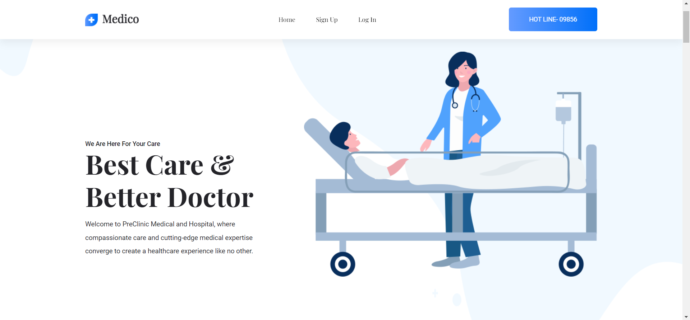
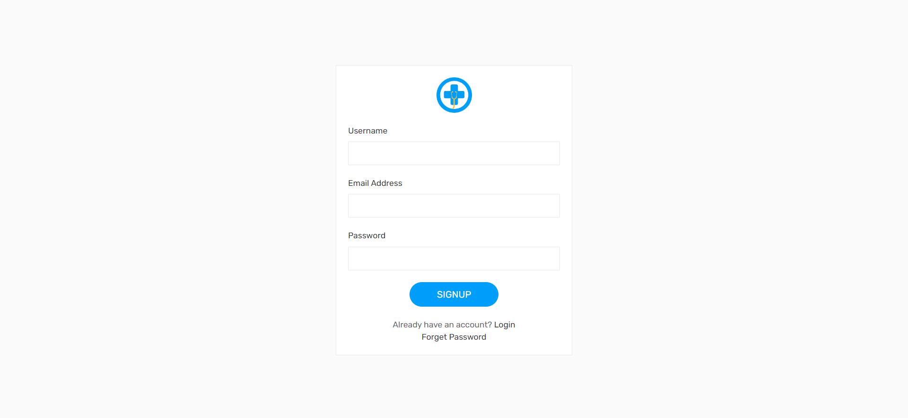
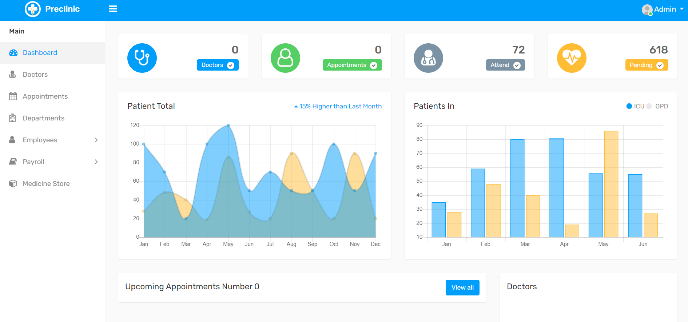
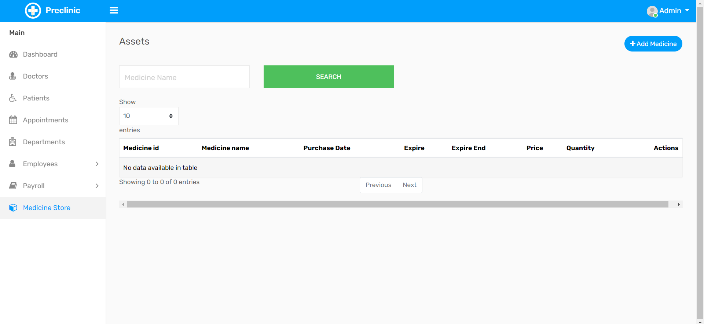
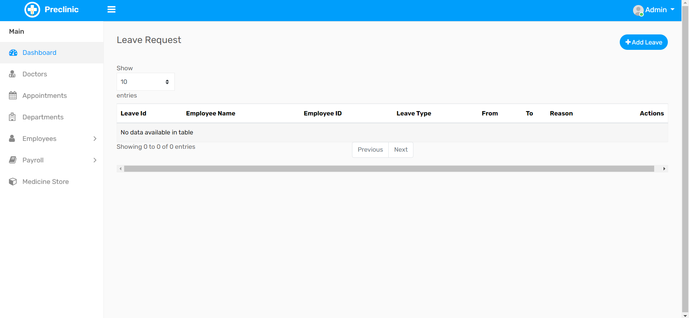

# Streamlining Healthcare Operations with Preclinic Medical and Hospital Management System

Presenting the Preclinic Medical and Hospital Management System – a groundbreaking backend project where I focused primarily on backend development. This innovative system harmoniously integrates Node.js, Express, MySQL, and EJS to revolutionize healthcare management. While the frontend, exported from [Colorlib](https://colorlib.com/), boasts captivating aesthetics and dynamic functionality through HTML, CSS, JavaScript, and EJS, the backend harnesses the power of Node.js and Express for high-performance, secure, and scalable operations. Together with MySQL, this fusion of technologies propels healthcare management into a realm of efficiency and excellence. Welcome to the future of healthcare management, sculpted by the prowess of Preclinic's backend architecture.e, optimize operations, and drive growth.

## Getting Started

1. **Clone or Download the Project**: Begin your journey by cloning or downloading the Preclinic Medical and Hospital Management System repository to your local environment.

2. **Install Dependencies**: Open the command prompt in the project folder and execute `npm install` to seamlessly install the required dependencies. For the latest packages, consider using `npm update`.

3. **Database Integration**: Import the comprehensive database file into your MySQL server. This foundational step ensures secure storage and efficient retrieval of critical medical and administrative data.

4. **System Activation**: Launch the system by entering `nodemon app` (or `node app`) in the command prompt. Watch as the Preclinic Medical and Hospital Management System comes to life, ready to revolutionize healthcare management.

## Empowering Features

### 1. **Home**: The intuitive dashboard offers a warm welcome, providing an instant overview of key hospital metrics. Effortlessly navigate through essential sections to manage patients, staff, resources, and more.

### 2. **Effortless Sign Up**: Simplify user onboarding with an intuitive signup process. Enable seamless access for medical professionals, administrators, and support staff, ensuring a quick start to their journey.

### 3. **Comprehensive Dashboards**: Gain actionable insights with interactive dashboards. Visualize patient trends, track admissions, monitor occupancy rates, and make informed decisions to enhance hospital operations.

### 4. **Advanced Medicine Store**: Effortlessly manage your medical inventory with the integrated Medicine Store feature. Keep stock levels optimized, streamline procurement, and ensure a seamless supply chain.

### 5. **Streamlined Employee Leave Management**: Simplify staff leave management with a dedicated module. Enable employees to request leaves, automate approval workflows, and ensure a well-organized workforce.

## Elevate Your Healthcare Management

Embrace the transformative power of the Preclinic Medical and Hospital Management System. Built specifically for the dynamic healthcare environment, this system is designed to optimize operations, enhance patient care, and streamline administrative tasks. Powered by Node.js, Express, MySQL, and EJS, it's the perfect solution for Preclinic Medical and Hospital's unique needs. Embrace innovation, elevate patient experiences, and shape the future of healthcare management today.
